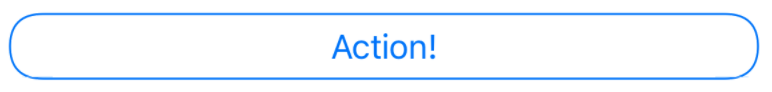
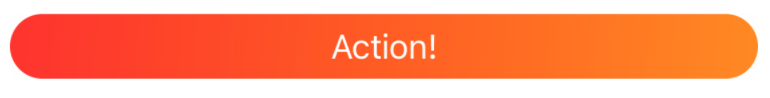
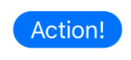
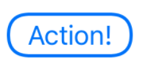

# SUEButtons

SwiftUI ButtonStyles 

<p align="center">
<a href="LICENSE.md">
    
</a>
<a href="https://swift.org">
    
</a>

SUE stands for *S*wift*U*I *E*xtras and is a collection of small SwiftUI libraries for various recurring use cases

## Gallery

### CapsuleButtonStyle
```swift
    Button("Action!").buttonStyle(CapsuleButtonStyle())
```


### GradientButtonStyle
```swift
    Button("Action!").buttonStyle(GradientButtonStyle())
```


### RectangleButtonStyle
```swift
    Button("Action!").buttonStyle(RectangleButtonStyle())
```


### RoundedFillButtonStyle
```swift
    Button("Action!").buttonStyle(RoundedFillButtonStyle())
```


### RoundedOutlineButtonStyle
```swift
    Button("Action!").buttonStyle(RoundedOutlineButtonStyle())
```



## License

MIT license; see [LICENSE](LICENSE.md).
(c) 2020
